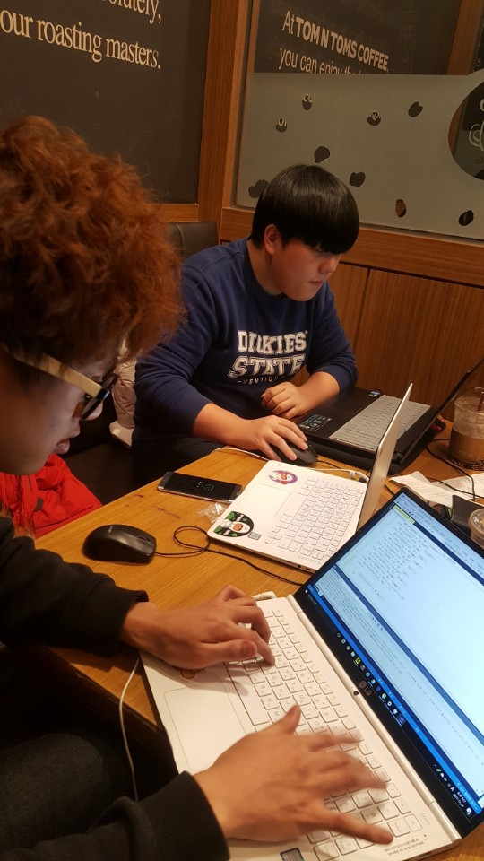

# 4500keylogger

Open source project, Create a keylogger to operate at windows. and Manage Wiretapped contents through the apache2 Web server.

# What is this ?

Use C and Python to create the Keylogger.exe file. Project of the Keylogger distributed through Apache2 is the project to output the transmitted data in real time.

# Member

## intadd (leader)
 create web site for manger of keylogger. and server shell script setting, compile C,Python in linux.  
 

 
## mij9929, S686 
 
create C keylogger file, and Module sending txt file to server 
 

 
## Phasekiller
 
Create Register as a starting program for the victim computer in keylogger 
 

 

